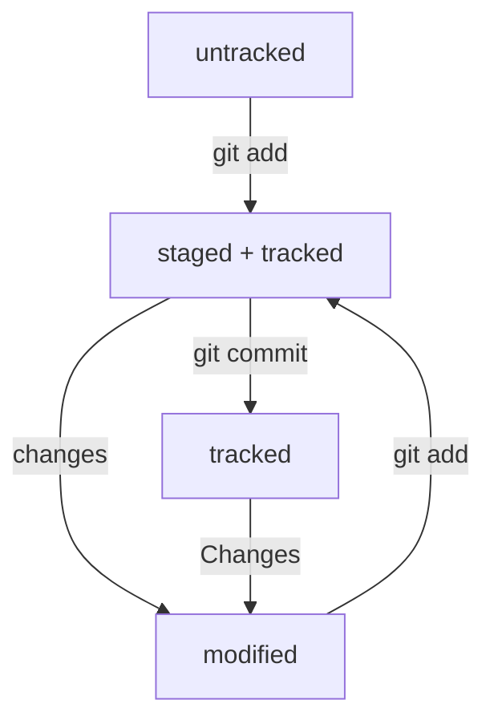

# Основные моменты работы с Git

## Базовое ориентирование

1. pwd - узнать, в какой папке находишься

2. cd - изменить директорию 

 * добавить ~ если хочешь переключиться на домашнюю директорию

 * добавить .. если хочешь вернуться на предыдущую директорию
 
 * с помощью / можно переходить через несколько директорий

 * добавить . для перехода в текущую директорию (иногда надо)

3. ls - вывести содержимое директории

 * добавить -а чтобы увидеть расширенный список

 * добавить ~ чтобы увидеть содержимое домашней директории

 * добавить .. чтобы увидеть содержимое родительской директории

## Операции с файлами

1. touch [имя-файла]- создание файлов в текущей директории

2. mkdir [имя-папки]- создание новой директории

 * добавить ~ для создания в домашней директории

 * добавить .. для создания в родительской директории

3. cp [имя-файла] [/имя-директории] - для копирования файла в другую директорию

4. mv [имя-файла] [/имя-директории] - для перемещения файла в другую директорию

5. cat [имя-файла] - чтение файла

6. rm [имя-файла] , rmdir [/имя-директории], rm -r [/имя-директории] - удаление файла/папки/папки с файлами, соответственно

## Работа в Git

1. && - совместить несколько команд

2. Стрелка вверх - посмотреть предыдущие команды

3. cd [начальная-буква] Tab  - поиск в папке по началу названия

4. cd/ - перейти в корневую папку

5. git init - загитить

6. rm -rf . git - разгитить

7. git status - узнать состояние git

8. git add -all - добавить все файлы в git

9. git commit -m 'текст-коммита' - сделать коммит

10. git log - история коммитов

## Хеш

**Хеш** - идентификатор коммита.

**Хеширование** - способ преобразовать набор данных и получить их "отпечаток".

Информация о коммите - набор данных: 
* когда сделан коммит;
* содержимое файлов в репозитории
* ссылка на предыдущий коммит

Информация хешируется с помощью алгоритма **SHA-1** и находится в виде строки, 40 символов, 0-9 и A-F

Свойства хеша: 
* одинаковый хеш для одного набора данных
* при изменении данных меняется и хеш

Хеш и таблица [хеш - инфа о коммите] находятся в служебных файлах в .git

## Исследуем лог в git log

Состоит из 4-х строчек

1. Коммит и его хеш
2. Автор коммита
3. Дата и время коммита
4. Сообщение

Если коммитов много, то используется сокращенный лог git log --oneline

## HEAD

**HEAD** - файл, указывающий на последний коммит

## Статусы в Git

* **untracked** - видимый, но не отслеживаемый
* **staged** - список файлов на коммит после git add
* **tracked** - файлы после git add и git commit
* **modified** - не совпадает с последней сохраненной версией

**Жизненный** **цикл** **файлов** **в** **Git**

Какие статусы можно увидеть в git status:
* staged
* modified
* untracked

Какие ситуации могут быть:
1. Нет ни staged, ни modified, ни untracked файлов
2. Найдены неотслеживаемые файлы
3. Найдены изменения, которые не войдут в коммит
4. Файл добавлен в staging area, но после этого изменен